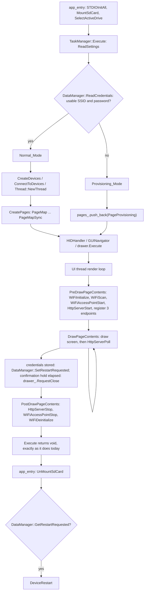

# Design Document

## Overview

This feature adds a second startup mode to pedal.guru. At startup the application reads the
Credential_Store from the SD card; if it does not yield a usable SSID and password, the application
enters Provisioning_Mode instead of Normal_Mode, and the whole of that mode is expressed as **one page
in `pages_`** — `PageProvisioning` — which owns the radio, the HTTP server and the confirmation
countdown. When the credentials are stored, the page tears everything down in order and the device
restarts into Normal_Mode.

The work splits across four repositories, and the split follows the ground rules exactly:

| layer | what it gains |
|---|---|
| **net.ll** (C) | access point start/stop, station connect, and a whole HTTP server with per-path callbacks. Knows nothing about the content it serves. |
| **hal.ll** (C) | one operation: restart the device. |
| **fs.ll** (C) | one operation: `TruncateFile`, wrapping FatFs's `f_truncate`, so a file that has become shorter can be cut back to the length just written (D27; see "The Credential_Store", "Writing the Credential_Store"). |
| **pedal.guru** (C++) | the mode decision, the Credential_Store reader and writer inside `DataManager`, the configuration page content, the endpoint callbacks, the Provisioning_Screen, and the teardown order. |

Nothing in pedal.guru touches a socket, a radio or an SDK. No platform preprocessor macro is tested
anywhere; every platform difference is a source-list difference, in the seam net.ll and hal.ll already
use.

### What the investigation established, and one expectation it overturned

Two findings shaped the design and are worth stating before the architecture, because a design written
without them would be wrong:

- **Drawing text on the LCD already works.** `Texture::DrawText` (`src/GUI/Render/Texture.cpp`) wraps
  gui.ll's `CanvasDrawText`, and `PageMapSync::DrawPageContents` already uses it to draw sync progress.
  Five bitmap fonts are available through `Texture::GetFont` — Font8 (5 px wide), Font12 (7), Font16
  (11), Font20 (14), Font24 (17). `pedal.guru` is 10 characters and `http://192.168.33.1/` is 20, so at
  Font16 the URL is 220 px on a 240 px texture and at Font12 it is 140 px. **Requirement 3 needs nothing
  added to gui.ll.** The one real constraint is that the font tables are indexed as `ASCIIChar - ' '`,
  so only printable ASCII renders — irrelevant here, since the Provisioning_Screen draws only fixed
  ASCII strings and never an SSID.
- **net.ll's `WiFiScan` has no timeout parameter and blocks until the platform's scan finishes, and it
  is used exactly as it is.** There is no third thread available on the RP2040 (Requirement 9,
  criterion 2), so a timeout cannot be imposed from the outside without breaking the two-thread
  constraint, and bounding it from the inside would mean a new net.ll function or a changed signature
  for a bound the platform already respects in practice. The dev settled it: **there is no
  Scan_Timeout**. The application lives with the platform's blocking scan until it returns, and the
  focus stays on the MCU work.

  The honest consequence, since it is visible to the rider: the bring-up scan runs inside
  `PreDrawPageContents`, which the render loop calls **before the first frame**, so the display shows
  nothing for as long as the scan takes — expected to be 1.5 to 2 seconds on both radios, unbounded in
  principle. The Provisioning_Screen appears only once the scan has returned and the access point and
  server are up. The scan-failure paths are unaffected and stay as the requirements have them: an empty
  Network_List, and the rider typing an SSID by hand.

### Where the rest of the plumbing stands today

Verified in the code, so the design does not assume anything is already there:

- net.ll's radio API is `WiFiInitialize`, `WiFiDeinitialize`, `WiFiScan` and nothing else. No connect,
  no access point, no server. `HttpDownloadFile` is the only HTTP surface, download-only, and a stub on
  both hardware platforms.
- fs.ll's `OpenFile` is `FA_OPEN_ALWAYS | FA_READ | FA_WRITE`: it **creates** the file when missing,
  positions at offset 0 and **does not truncate**. It also calls `f_unmount` on failure. Both facts have
  direct consequences below.
- `TaskManager::Execute` creates the sensor thread on line 47, constructs `GUIDrawer drawer;` on line 49
  and calls `CreatePages(drawer);` on line 50. `ReadSettings` hardcodes the six page flags and
  `mapSyncingBaseUrl` behind a `TODO`; `SettingsData` has no network fields.
- `GUIDrawer::Execute` calls the current page's PreDraw callback once, then loops on
  `!window.ShouldClose()` calling the Draw callback, then calls PostDraw once and closes the window.
  There is no way to ask that loop to stop.
- `src/Platform/<Platform>/Time.hpp` exposes only `Time::Delay(unsigned int)`. hal.ll has `TicksMs()`,
  but pedal.guru has no wrapper over it.

## Architecture



Layer ownership, restated as a rule rather than a picture:

```
PageProvisioning ....... the screen, the render-loop cadence, the confirmation countdown
    |
SelfHost::Server ....... routes, endpoint callbacks, request decoding, response ownership
    |         \
    |          SelfHost::ConfigurationPage ... the HTML constant, the Network_List rendering, the JSON
    |
DataManager ............ the Credential_Store reader and writer, and the restart request
    |
net.ll (HttpServer.h, WiFi.h) | fs.ll (FileSystem.h) | hal.ll (HAL.h)
```

`PageProvisioning` is the only object that knows the flow; `Server` is the only object that knows HTTP;
`DataManager` is the only object that knows the file format. net.ll knows none of the three.

## The startup mode decision

### Where it happens

Requirement 1, criterion 1 requires the check to precede the devices, the sensor thread and the pages.
The card is already mounted in `app_entry` before `TaskManager` exists, so the check goes at the **top of
`TaskManager::Execute`**, right after `ReadSettings()` and before `CreateDevices()`:

```cpp
void TaskManager::Execute() {
    ReadSettings();
    provisioned_ = DataManager::GetInstance()->ReadCredentials(credentials_);

    CreateDevices();
    ConnectToDevices();
    Thread::NewThread(GetDevicesData);

    GUIDrawer drawer;

    if (provisioned_) {
        CreatePages(drawer);
    } else {
        pages_.push_back(std::make_unique<PageProvisioning>(drawer, settings_));
    }

    HIDHandler handler;
    GUINavigator guiNavigator(handler, pages_);
    drawer.Execute();
}
```

**Nothing else in `TaskManager` changes, and `Execute()` keeps its `void` signature.** That is settled
(D22): `ReadSettings`, `CreateDevices`, `ConnectToDevices`, the sensor thread, `HIDHandler`,
`GUINavigator` and `drawer.Execute()` all run in both modes, unchanged, because that uniformity is
deliberate groundwork for improvements the dev has in mind. The only difference between the two modes is
which pages land in `pages_`, which is the exact branch D8 and Requirement 1 criteria 7 to 9 call for.
The mode is decided once per program run and lives in `provisioned_`, so Requirement 1 criterion 6 holds
without any further state.

The restart therefore cannot be reported through a return value. `PageProvisioning` records the request
in `DataManager` instead, and `app_entry` reads it back after `Execute()` has returned; see "The
restart".

### Read-only, and the trap that makes it non-obvious

Requirement 1 criterion 5 forbids creating or truncating any file while the mode is being decided, and
fs.ll's `OpenFile` **creates the file when it is missing**. So `DataManager::ReadCredentials` must
guard with `PathOrFileExists("settings")` and return without opening anything when the file is absent —
not as a shortcut, but because opening it would leave an empty `settings` file behind and violate the
criterion.

The second trap is that `OpenFile` calls `f_unmount` on failure. If the file exists and the open still
fails, the volume is gone and every later card access in the program run fails, including the
Credential_Store write in Provisioning_Mode. The recovery is a re-mount through `MountSdCard()` /
`SelectActiveDrive()`, and **it belongs inside `DataManager::ReadCredentials`, not in
`TaskManager::Execute`** — putting it in `Execute` would be a workflow change, which D22 rules out, and
the reader is the only place that knows the volume was torn down. It is safe there for the same reason
the original mount is safe in `app_entry`: this particular read happens before `Thread::NewThread`, so
only one thread exists when it runs, which is what `f_mount` requires. No other `DataManager` call
mounts anything. Requirement 1 criterion 4 already says the existing content stays unchanged, which it
does — nothing was written.

## The Credential_Store

### `DataManager` owns the file, and there is no separate store class

Settled by the dev (D23): the `settings` file belongs to **`DataManager`**, and no `SettingsStore` class
exists. `DataManager` is already the singleton that centralizes state shared between the two threads
behind a `Mutex`, so putting the file there means both threads reach it safely by construction rather
than by an argument about where the calls happen to live today.

The existing shape is kept exactly: a private constructor, a `static DataManager* instance_`, a
`static Mutex mutex_`, and `GetInstance()` taking that lock before creating the instance. Today the class
holds one `std::list<GPSFixData>` with `Push` and `Pop`, each taking `mutex_` around the list access. The
file surface is added in the same shape:

```cpp
class DataManager {
    private:
        static DataManager* instance_;
        static Mutex mutex_;
        DataManager() {}
        ~DataManager() {}
        std::list<PedalGuru::GPSFixData> gpsFixData_;
        bool restartRequested_;
        bool ReadSettingsFile(SettingsFileData& fileData);
        bool WriteSettingsFile(const SettingsFileData& fileData);
    public:
        void Push(PedalGuru::GPSFixData& gpsFixData);
        void Pop(PedalGuru::GPSFixData& gpsFixData);
        bool ReadCredentials(CredentialData& credentials);
        bool WriteCredentials(const std::string& ssid, const std::string& password);
        void SetRestartRequested();
        bool GetRestartRequested();
        static DataManager* GetInstance();
};
```

Which calls take the lock, stated rather than implied: `ReadCredentials`, `WriteCredentials`,
`SetRestartRequested` and `GetRestartRequested` each take `mutex_` on entry and release it on exit, exactly as
`Push` and `Pop` do. The two private file helpers take no lock and are called only from inside a public
method that already holds it. `Mutex` is not recursive on any of the three platforms, so **no public
method may call another public method** — and none does; the lock is taken once per public call, and
`GetInstance()` has already released it by the time the caller invokes anything.

**What the mutex cannot fix, and does not try to:** `f_mount` is never thread-safe in FatFs at any
configuration, so mount and unmount stay in `app_entry`, outside any thread, exactly where they are
today. `DataManager` guards *file access*, not mounting. The one exception is the re-mount inside
`ReadCredentials` described above, which is reachable only on the startup read, before the sensor thread
exists.

This closes something fs.ll left open. fs.ll's `AGENTS.md` §12 records thread safety as undecided and
notes that little or nothing may need to change inside fs.ll *if* every card access funnels through the
parent application's `DataManager` singleton — and asks for that to be verified from here. This decision
is what makes it true for the `settings` file: the serialization point now exists above the library,
which is exactly the application-level design the FatFs rules in that section call for. It is a real
alignment, not a coincidence. Note what it does **not** cover yet: `Texture::DrawPng` and
`OpenStreetMapAPI::DownloadTile` still reach the card directly from the UI thread, so the answer for
fs.ll as a whole is still the dev's to give (`TODO-E2`).

### What carries the parsed result

The file is `key=value` lines (D2, D20), and Requirement 6 criterion 8 requires unrecognised keys to
survive a write byte-identically. So the parsed form is not two strings, it is the **whole file as an
ordered list of entries** — `SettingsEntry`, `SettingsFileData` and `CredentialData`, defined under
"Data Models".

Order is preserved because the writer emits the entries in the order it read them, which is what makes
"byte-identical" achievable for the lines we do not understand.

A line with no `=` is kept as an entry with an empty key and the whole line as its value, so it too
survives a write. That is the cheapest way to satisfy criterion 8 without deciding what such a line
means.

### Reading, with the API that exists

`ReadFile` takes a `FIL*`, a buffer and a byte count, returns the count read, and discards the
`FRESULT`. There is no line reader, so the whole file is pulled in fixed chunks and split in memory.

`ReadSettingsFile` opens the file, loops `ReadFile(&file, chunk, sizeof(chunk))` with a 512-byte chunk
appending into a `std::string` until a short read ends it, closes the file, then splits on `'\n'`
discarding a trailing `'\r'` and splits each line at its first `'='`. The accumulated size is capped —
a `settings` file larger than a few kilobytes is a corrupt file, not a configuration, and the cap keeps
the read bounded on a 264 KB device.

`ReadCredentials` calls `ReadSettingsFile`, looks up `WIFI_SSID` and `WIFI_PWD` **wherever they appear, in
any order, separated by anything** (Requirement 1 criterion 10), and returns true only when the SSID is
non-empty and at most 32 bytes and a `WIFI_PWD` line is present. An absent `WIFI_PWD` line, an empty
SSID, or an over-long SSID all mean not provisioned (Requirement 1 criterion 4, Requirement 6
criterion 10).

One honest limit: because `ReadFile` discards the `FRESULT`, a hard I/O error is indistinguishable from
end of file. So the "FS_LL reports a read failure" branch of Requirement 1 criterion 4 is only reachable
through a failed `OpenFile`; a read error surfaces as a file that yields no credentials, which lands in
the same Provisioning_Mode outcome. The requirement is satisfied in effect, not by distinguishing the
two.

### Writing the Credential_Store

fs.ll gains one function, `bool TruncateFile(FIL *file)` in `src/lib/FileSystem.h` and `FileSystem.c`,
wrapping FatFs's `f_truncate`, which cuts the file at the **current file pointer**. `WriteFile` is not
changed and is not renamed (D27).

`WriteSettingsFile` is a read-modify-write, and it is **two opens, not one**:

1. `ReadSettingsFile` opens the file, reads the whole existing content, and closes it. This is where the
   unrecognised keys come from, so it has to happen before anything is written.
2. The `WIFI_SSID` and `WIFI_PWD` entries are replaced, or appended when absent, and **every** entry is
   serialised back into one `std::string` in the order it was read.
3. `OpenFile` — which positions at offset 0 and does not truncate — then one `WriteFile` with that whole
   content (Requirement 6 criterion 1), then `TruncateFile`, then `CloseFile`.

The ordering in step 3 is the point, and it follows from fs.ll's real API: `OpenFile` leaves the pointer
at offset 0 and truncates nothing, and after the single `WriteFile` the pointer sits at the end of what
was just written — which is exactly where the cut has to be made. So the truncation comes after the
write, never before it.

Two opens rather than one because **fs.ll exposes no seek**. A single open cannot read to the end of the
file and then write from offset 0 again; the only way back to offset 0 is `CloseFile` followed by
`OpenFile`. Hence: read on the first open, write and truncate on the second.

**Why this does not lose the other settings.** The dev raised the concern explicitly, so it is answered
here rather than left to the reader: the truncation happens *after* the full new content — including
every line the reader did not recognise, byte-identical — has already been written. The region being cut
therefore lies past the end of that content and is leftover from the previous, longer file. It can never
be a live setting. A future `SettingsData` line survives a credential save (Requirement 6 criterion 8,
`TODO-C4`), and no byte of the previous content remains (criterion 7).

**Seek was considered and rejected.** Adding `f_lseek` to fs.ll is easy and FatFs has it, but a seek only
positions the pointer — it neither shortens a file nor shifts bytes — so it does not address this problem
at all.

**Line-level editing is not an option either.** No filesystem exposes a line primitive: a file is a byte
array, and replacing a line with one of a different length requires shifting everything after it. That is
precisely why the whole content is rebuilt in memory and rewritten — the in-memory `std::string` rebuild
*is* the replace.

### How this relates to `SettingsData` and `TaskManager::ReadSettings`

`SettingsData` and `ReadSettings` are left exactly as they are. `DataManager` reads and writes only
the two WiFi keys and preserves everything else, which is what makes the later `TODO-C4` migration a
pure addition: when `SettingsData` moves into this file, `ReadSettings` starts asking `DataManager` for
the file entries and mapping the ones it recognises, and the keys this feature writes keep working
unchanged. Nothing about that migration is done now, and the file code deliberately does not know
`SettingsData` exists.

## Data Models

The types this feature introduces, and where each one lives in the tree.

**`src/Model/SettingsEntry.hpp`** and **`src/Model/CredentialData.hpp`**, beside `SettingsData.hpp` and
the rest of the plain data types:

```cpp
namespace PedalGuru {

struct SettingsEntry {
    std::string key;
    std::string value;
};

struct SettingsFileData {
    std::list<SettingsEntry> entries;
};

struct CredentialData {
    std::string ssid;
    std::string password;
    bool ssidPresent;
    bool passwordPresent;
};

}
```

**net.ll's `src/lib/HttpServer.h`** — C, and the only types that cross the boundary between net.ll and
pedal.guru:

```c
typedef enum {
    HTTP_METHOD_GET,
    HTTP_METHOD_POST
} HttpMethod;

typedef struct {
    HttpMethod Method;
    const char *Path;
    const char *Query;
    const char *Body;
    uint16_t BodyLength;
} HttpRequest;

typedef struct {
    uint16_t StatusCode;
    const char *ContentType;
    const char *Body;
    uint32_t BodyLength;
} HttpResponse;

typedef void (*HttpEndpointCallback)(const HttpRequest *request, HttpResponse *response, void *context);
```

**`src/Model/ProvisioningState.hpp`**, the state `PageProvisioning` shows on the Provisioning_Screen:

```cpp
namespace PedalGuru {

enum class ProvisioningState {
    SERVING,
    CONFIGURED,
    STORE_FAILED,
    UNAVAILABLE
};

}
```

## Components and Interfaces

Four boundaries, in the order the flow crosses them: net.ll's new C API (access point, station connect,
`HttpServer`), the pedal.guru objects that sit on it (`SelfHost::Server`, `SelfHost::ConfigurationPage`,
`SelfHost::FormBody`), the page that owns the mode (`PageProvisioning`), and hal.ll's one operation
(`DeviceRestart`). The fifth component is the existing `DataManager`, which gains the Credential_Store
and the restart request; it is reached from the startup path as well as from the server, so its surface
is declared where the file format is described — "The Credential_Store", under "`DataManager` owns the
file".

### net.ll additions

All of it is C. The radio operations go into the existing `src/lib/WiFi.h` and each platform's
`WiFi.c`, because they are radio state. The server is a new `src/lib/HttpServer.h` with one
`HttpServer.c` per platform folder.

#### Access point

```c
#ifndef WIFI_ACCESS_POINT_ADDRESS
#define WIFI_ACCESS_POINT_ADDRESS "192.168.33.1"
#endif

bool WiFiAccessPointStart(const char *ssid, const char *password);
bool WiFiAccessPointStop(void);
bool WiFiAccessPointIsRunning(void);
```

A null or empty `password` means an open access point, which is what pedal.guru passes (D5). The address
is a `#ifndef`-guarded macro in the collection's style, and net.ll **configures** it rather than
accepting the platform default — ESP-IDF's softAP defaults to 192.168.4.1, so without that step the URL
on the LCD would be wrong on that target (D18). `WiFiAccessPointStart` requires `WiFiInitialize` to have
succeeded first, matching how `WiFiScan` already works.

#### Station connect

```c
bool WiFiStationConnect(const char *ssid, const char *password);
```

Synchronous: it returns only once the connection is established or has failed. Requirement 2
criterion 7 is implemented inside it — when the access point is running it returns false immediately and
leaves the access point alone, because there is one radio and it cannot hold both modes. Nothing in this
feature calls it (D14, Requirement 8 criterion 3).

#### The HTTP server

`HttpMethod`, `HttpRequest`, `HttpResponse` and `HttpEndpointCallback` are defined under "Data Models";
the surface itself is:

```c
#define HTTP_SERVER_MAX_REQUEST_SIZE 2048
#define HTTP_SERVER_MAX_ROUTES 8

bool HttpServerStart(uint16_t port);
bool HttpServerRegisterEndpoint(HttpMethod method, const char *path,
                                HttpEndpointCallback callback, void *context);
bool HttpServerPoll(uint32_t timeoutMilliseconds);
void HttpServerStop(void);
```

**`HttpServerPoll` is the crux of the whole design.** net.ll creates no thread (Requirement 9
criterion 4) and pedal.guru creates no third thread (criterion 2), so somebody has to lend the server a
thread, and it has to be lent in slices short enough that the render loop keeps running.
`HttpServerPoll` waits up to `timeoutMilliseconds` for one connection, and if one arrives it reads the
request, calls the matching callback, writes the response and closes the connection, all before
returning. It returns whether a request was served. Maximum_Connections of 1 falls out of this shape
rather than being enforced on top of it: exactly one connection is accepted per poll and it is serviced
to completion, and the listening socket's backlog is 1, so anything beyond that is refused by the TCP
stack.

**Buffer ownership.** net.ll copies nothing in either direction.

- *Request in*: net.ll owns a static buffer of `HTTP_SERVER_MAX_REQUEST_SIZE` bytes, reads the request
  line, the headers and the body into it, and NUL-terminates the path, the query and the body in place.
  The three pointers in `HttpRequest` point into that buffer and are valid **only for the duration of
  the callback**. `BodyLength` is reported separately so a body carrying arbitrary bytes works;
  form-encoded bodies never carry a NUL, but reporting the length costs nothing and removes the
  question.
- *Response out*: the callback fills `HttpResponse` with a pointer it owns, and that pointer must stay
  valid **until `HttpServerPoll` returns**. net.ll writes the body out inside the poll, so that window
  is exactly one synchronous call. This is what lets a callback point straight at the compiled-in page
  constant, or at a `std::string` member of a C++ object that outlives the page — no allocation, no
  copy, no lifetime puzzle. net.ll defaults `StatusCode` to 200 and `ContentType` to `text/html` before
  the call, so a callback that only sets a body is correct.

**`void *context`, not file-scope state.** The callback is a C function pointer, and pedal.guru's
response logic lives in C++ objects. Passing `this` as `void *` and casting it back inside a small
`extern "C"` trampoline is the standard C idiom, and it is precisely what Requirement 9 criterion 11
asks for: the C++ object is reached without a C++ type crossing the boundary. The alternative —
file-scope pointers in pedal.guru and no `context` parameter in net.ll — makes the same C++ objects
reachable but turns them into hidden global state and makes a second server instance impossible. The
`void *` costs one pointer per route and is carried straight through, so net.ll still knows nothing
about what it points at.

#### The three platform implementations

| | Simulator | ESP32 | RP2040 |
|---|---|---|---|
| `WiFiAccessPointStart` | **stub returning true**, no radio started (D-AP, Requirement 2 criterion 6, Requirement 9 criterion 9) | `esp_wifi` softAP, `esp_netif_set_ip_info` to 192.168.33.1, DHCP server restarted around it | **stub returning false** |
| `WiFiStationConnect` | stub returning false | `esp_wifi_connect` in station mode | stub returning false |
| `HttpServer.c` | real: POSIX sockets, `select` for the poll timeout | real: the same BSD socket code over lwIP | **stub**: `HttpServerStart` returns false |

Two points about that table are deliberate and not obvious.

**The ESP32 server is BSD sockets, not `esp_http_server`.** ESP-IDF's HTTP server component creates its
own task, which Requirement 9 criterion 5 forbids. lwIP's BSD socket API on that platform is close
enough to POSIX that the Simulator implementation ports nearly unchanged, which also means one body of
logic is being exercised on the desktop before it ever runs on hardware.

**The RP2040 is a stub for this feature, and that is a scope call, not an omission.** net.ll currently
publishes `CYW43_LWIP=0` because nothing there needs TCP/IP. An access point plus a server needs lwIP
turned on, which means switching the linked target to `pico_cyw43_arch_lwip_poll`, authoring and tuning
an `lwipopts.h` for a chip with 264 KB of RAM, and adding a DHCP server — the pico-sdk ships none, the
`dhcpserver.c` everyone uses lives in pico-examples. On top of that the target board has no radio wired
yet. D6 puts ESP32 first and the RP2040 immediately after, so the RP2040 stub is what keeps the firmware
linkable now (Requirement 9 criteria 7 and 8) and lwIP is the RP2040's own piece of work. The visible
consequence, stated plainly: an unprovisioned RP2040 shows the "cannot be configured" screen of
Requirement 2 criterion 4 until that work lands.

### The Provisioning_Server wiring in pedal.guru

`src/API/SelfHost/` holds the pedal.guru side (D21), beside `src/API/OpenStreetMapAPI.{cpp,hpp}`:

```
src/API/SelfHost/Server.{cpp,hpp}             routes, callbacks, response ownership
src/API/SelfHost/ConfigurationPage.{cpp,hpp}  the HTML constant, Network_List rendering as markup and
                                              as JSON, and the two escapers
src/API/SelfHost/FormBody.{cpp,hpp}           form-encoded body decoding
```

`FormBody` belongs there rather than in `src/Helper` because D21 makes that folder the home for whatever
the self-hosted configuration turns out to need, and percent-decoding is HTTP's, not text handling in
general.

#### Routes and the C boundary

```cpp
namespace PedalGuru {

class Server {
    public:
        bool Start(const std::list<WiFiNetwork>& networks);
        void Stop();
        bool Poll(unsigned int timeoutMilliseconds);
        bool CredentialsStored() const;
        bool CredentialStoreFailed() const;
    private:
        void OnRoot(const HttpRequest* request, HttpResponse* response);
        void OnScan(const HttpRequest* request, HttpResponse* response);
        void OnSave(const HttpRequest* request, HttpResponse* response);
        ConfigurationPage page_;
        std::list<WiFiNetwork> networks_;
        std::string responseBody_;
        bool credentialsStored_;
        bool credentialStoreFailed_;
};

}
```

`Start` registers the three routes of D18 through `HttpServerRegisterEndpoint`, passing `this` as the
context. The C linkage lives in three file-scope trampolines in `Server.cpp`:

```cpp
extern "C" {

static void ServeRoot(const HttpRequest* request, HttpResponse* response, void* context) {
    static_cast<PedalGuru::Server*>(context)->OnRoot(request, response);
}

}
```

`responseBody_` is the single owner of every generated body. A handler builds into it and points
`response->Body` at `responseBody_.data()` with `responseBody_.size()` as the length; the member
outlives the `HttpServerPoll` call, which is the whole lifetime the contract requires. `GET /` with an
empty Network_List is the one case that needs no buffer at all — the page constant can be pointed at
directly.

#### The HTML constant

D11 and Requirement 4 criterion 1 put the page in the firmware. `ConfigurationPage.cpp` holds it as a
file-scope raw string literal, with one substitution point:

```cpp
static const char PAGE_TEMPLATE[] = R"HTML(<!DOCTYPE html>
<html lang="en"><head><meta charset="utf-8">
<meta name="viewport" content="width=device-width, initial-scale=1">
<title>pedal.guru</title><style>/* inline, no external asset */</style></head>
<body>
<form method="post" action="/settings/save" accept-charset="UTF-8">
<select id="ssid" name="ssid">%NETWORKS%</select>
<input type="text" name="ssidTyped">
<input type="password" name="password">
<button type="submit">Save</button>
</form>
<button id="rescan">Rescan</button>
<script>/* inline, no external asset */</script>
</body></html>
)HTML";
```

No asset comes from any other host (Requirement 4 criterion 2): the CSS and the JS are inline in that
literal. Keeping it a plain `char[]` rather than a `std::string` is what lets the unsubstituted case be
served straight out of flash.

#### Rendering the Network_List

`ConfigurationPage::RenderNetworkOptions(const std::list<WiFiNetwork>& networks)` returns the
`<option>` block that replaces `%NETWORKS%`. The de-duplication and the filtering below happen once, in a
helper both this renderer and the JSON renderer of `GET /network/scan` call, so the two routes can never
disagree about which networks exist:

- **De-duplication** (Requirement 5 criterion 5): net.ll reports one entry per BSSID, so entries are
  grouped by SSID bytes and the one with the highest `Rssi` supplies the authentication mode and the
  signal shown.
- **Empty SSIDs dropped** (criterion 6): a hidden network has an empty `Ssid`, and it is omitted. The
  free-text SSID field covers it.
- **Unknown authentication** (criterion 3): `WIFI_AUTH_MODE_UNKNOWN` is kept and labelled as
  unidentified rather than being dropped or guessed.
- **Empty list** (criterion 4): the substitution yields a single disabled option saying no network was
  found; the free-text SSID field is always present, so typing one directly always works.
- **Escaping** (criterion 2): `&`, `<`, `>`, `"` and `'` are replaced with their entity forms in both the
  option text and the `value` attribute, and nothing else is altered. The byte-identical round trip
  holds because the browser un-escapes the attribute back to the original bytes, the page is UTF-8 with
  `accept-charset="UTF-8"`, and the form's `application/x-www-form-urlencoded` encoding percent-encodes
  those UTF-8 bytes, which `FormBody` reverses exactly.

#### Decoding the submission

`FormBody` parses `application/x-www-form-urlencoded`: split on `&`, split each pair at the first `=`,
then percent-decode with `+` mapped to a space. It works on the byte level and never validates UTF-8, so
whatever the rider typed arrives as the exact bytes the browser sent (Requirement 6 criterion 1). An
invalid `%` escape leaves the bytes as they are rather than throwing, because a rejected SSID is a 400
in `OnSave`, not an exception in a decoder.

`OnSave` then applies Requirement 6's validation in order — SSID empty, whitespace-only or over 32 bytes
gives 400; a password outside 8 to 63 characters for a non-open network gives 400; an open network
accepts an empty password and writes `WIFI_PWD=` — and only then calls
`DataManager::GetInstance()->WriteCredentials`. Which authentication mode applies comes from `networks_` looked up by
the submitted SSID; an SSID typed by hand that is not in the list has no reported mode, so it is treated
as non-open and the 8-to-63 range applies.

#### `GET /network/scan` returns JSON

Settled by the dev (D24): the endpoint responds with content type `application/json` carrying the
Network_List as data, and the page's JavaScript parses it and rebuilds the `<option>` list in the DOM.
The shape is an array of objects, one per presented network, after the same de-duplication and the same
empty-SSID omission `GET /` applies:

```json
[{"ssid": "home-2g", "auth": "WPA2", "rssi": -47}]
```

Three keys and nothing else: the SSID bytes, the authentication mode as a short label (with the
unidentified label of Requirement 5 criterion 3 where net.ll reports a mode it cannot name), and the
signal strength as the RSSI integer net.ll reported. A failed scan responds with a non-200 status and a
short plain-text message; the JS leaves the select and every typed value untouched (Requirement 5
criteria 8 and 9).

**Both renderers exist, and neither replaced the other.** `GET /` still substitutes `%NETWORKS%` with
server-side rendered `<option>` markup, so the page works on first load with no JavaScript having run
yet; `GET /network/scan` serves the same list as JSON for the rescan. `ConfigurationPage` therefore owns
two renderers over one `std::list<WiFiNetwork>`, and the de-duplication and filtering logic is shared
between them rather than written twice.

**That means a second escaper beside the HTML one**, and it is the part most easily got wrong, so it is
specified rather than left to the implementation. The JSON string escaper takes the raw SSID bytes and
emits a valid JSON string body:

- `"` becomes `\"` and `\` becomes `\\`;
- the control characters JSON names get their short escapes — `\b`, `\f`, `\n`, `\r`, `\t`;
- every other byte below 0x20 becomes `\u00XX`, since JSON forbids a raw control character in a string;
- `/` is **not** escaped, because it needs no escape and escaping it would alter the bytes for no reason;
- bytes at 0x80 and above are passed through unchanged. An SSID is an arbitrary byte string, and the
  response is UTF-8, so a valid UTF-8 SSID arrives at the page as itself and the byte-identical round
  trip of Requirement 5 criterion 2 holds. An SSID that is not valid UTF-8 would make the response
  undecodable, so such bytes are `\u00XX`-escaped per byte as well, which keeps the response parseable at
  the cost of those SSIDs reaching the page as their Latin-1 reading.

The HTML escaper is untouched and stays in use for `GET /`.

### `PageProvisioning`

`src/GUI/Page/PageProvisioning.{cpp,hpp}` (D21), a `BasePage` subclass like every other page, created
only by the Provisioning_Mode branch so it never enters the cycle `CreatePages` builds (Requirement 3
criterion 2):

```cpp
class PageProvisioning : public PedalGuru::BasePage {
    private:
        Server server_;
        std::list<WiFiNetwork> networks_;
        Texture screenTexture_ { 240, 240 };
        ProvisioningState state_;
        unsigned int confirmationStart_;
        void DrawScreen();
    public:
        using BasePage::BasePage;
        void PreDrawPageContents() override;
        void DrawPageContents() override;
        void PostDrawPageContents() override;
};
```

`ProvisioningState`, defined under "Data Models", carries the four things the screen can say.

**`PreDrawPageContents`** runs once, before the loop, and performs the bring-up in the order Requirement
2 criterion 1 fixes: `WiFiInitialize`, then `WiFiScan` into `networks_`, then `WiFiAccessPointStart`,
then `server_.Start(networks_)`. A scan that fails or returns nothing leaves `networks_` empty and the
flow continues (criterion 5). A failed access point start or a failed server start sets `UNAVAILABLE`
(Requirement 2 criterion 4, Requirement 4 criterion 7).

**`DrawPageContents`** draws the screen and then services the server:

```cpp
void PageProvisioning::DrawPageContents() {
    DrawScreen();

    if (state_ == ProvisioningState::UNAVAILABLE) return;

    server_.Poll(SERVER_POLL_MILLISECONDS);

    if (server_.CredentialStoreFailed()) {
        state_ = ProvisioningState::STORE_FAILED;
    } else if (server_.CredentialsStored() && state_ != ProvisioningState::CONFIGURED) {
        state_ = ProvisioningState::CONFIGURED;
        confirmationStart_ = Time::TicksMs();
    }

    if (state_ == ProvisioningState::CONFIGURED
        && (Time::TicksMs() - confirmationStart_) >= CONFIRMATION_HOLD_MILLISECONDS) {
        DataManager::GetInstance()->SetRestartRequested();
        drawer_.RequestClose();
    }
}
```

Those two calls are how the restart reaches `app_entry` without `TaskManager::Execute` gaining a return
value (D22): the page records the request in the shared state holder, ends the render loop, and
`app_entry` reads the request back after `Execute()` has returned. `STORE_FAILED` and `UNAVAILABLE` never
reach that branch, so neither records a restart.

`DrawScreen` draws into `screenTexture_` — the SSID `pedal.guru` and `http://192.168.33.1/` on separate
lines, both visible at once on the round display (Requirement 3 criterion 1) — and blits it with
`window_.DrawTexture`, the same shape `PageMapSync` uses. `UNAVAILABLE` and `STORE_FAILED` swap the text
and stay on screen for the rest of the run; neither triggers a restart.

#### Which thread does what, and why the countdown is not a `Delay`

There are two threads and no more. The sensor thread runs `TaskManager::GetDevicesData` and this feature
never touches it. **Everything else is the UI thread**: the render loop, `HttpServerPoll`, all three
endpoint callbacks, and therefore every Credential_Store read and write. That is Requirement 9
criterion 3 satisfied structurally rather than by a lock — the callbacks are invoked synchronously from
inside `HttpServerPoll`, which is called from inside `DrawPageContents`, which the render loop calls.
There is no point at which two threads can be in the card.

`SERVER_POLL_MILLISECONDS` is the one number that trades the two responsibilities against each other.
The poll blocks the render loop for up to that long waiting for a connection, so a large value makes the
screen stop redrawing and a small value spins. Nothing on this screen animates and Requirement 3
criterion 3 only requires a redraw per pass, so a modest value keeps the loop lively while costing
nothing. **Settled at 100 milliseconds** (D25): nothing on the Provisioning_Screen animates, so 100 ms of
block per render pass costs nothing visible, and it leaves ample margin against a value low enough to
spin the loop for no reason.

**The Confirmation_Hold is a deadline, not a sleep.** `Time::Delay(5000)` would be the obvious way to
hold the confirmation for 5 seconds, and it is the wrong one: it would stop servicing the server for
those 5 seconds, so the phone's own confirmation fetch could be the request left unanswered — precisely
the thing Requirement 7 criterion 3 wants the hold for. Recording a `TicksMs()` start and continuing to
poll keeps the server alive across the hold and blocks nothing.

`Time::TicksMs()` does not exist yet. It is added to `src/Platform/<Platform>/Time.{hpp,cpp}` as
`static unsigned int TicksMs();` forwarding to hal.ll's `TicksMs()` — identical in all three folders,
like `Time::Delay` already is. hal.ll's counter wraps every ~49.7 days and unsigned subtraction stays
correct across the wrap, which is why the comparison above subtracts rather than testing against a
precomputed deadline.

`GUIDrawer::RequestClose()` does not exist either. `GUIDrawer` gains a `bool closeRequested_` and its
loop becomes `while (!window.ShouldClose() && !closeRequested_)`. That is the minimum needed for a page
to end the program, and it leaves `PostDrawPageContents` and `window.Close()` running exactly as they do
when the window is closed by the user.

**`PostDrawPageContents`** is where the teardown of Requirement 7 criterion 4 happens, and the order is
forced: the response was already handed to net.ll and written out before `HttpServerPoll` returned, so by
the time the loop exits step one is complete. Then `HttpServerStop()`, then `WiFiAccessPointStop()`, then
`WiFiDeinitialize()`, then `screenTexture_.Release()`. The card is not unmounted here — that belongs to
`app_entry`, where it already is.

### The restart

hal.ll gains one operation, declared in each platform's `HAL.h` after the stdio group:

```c
/* ---------------------------------------------------------------- system -- */

void DeviceRestart(void);
```

| platform | implementation |
|---|---|
| Simulator | `exit(EXIT_SUCCESS)` — closes the application (Requirement 7 criterion 2, D7) |
| RP2040 | `watchdog_reboot(0, 0, 0)`, which needs `hardware_watchdog` added to hal.ll's `PLATFORM_LIBRARIES` |
| ESP32 | `esp_restart()`, already covered by `esp_system` in `PLATFORM_REQUIRES` |

**The name is settled as `DeviceRestart`** (D25). On both MCUs this is a genuine device reset rather than
an application restart: `esp_restart()` and `watchdog_reboot()` both bring the chip back through its reset
vector with RAM re-initialised, so "Device" is the accurate word. The Simulator is the deliberate
exception and it is worth stating plainly: there `exit()` ends the process and nothing brings it back, so
the rider — or the dev — starts the binary again by hand. D7 already accepted that asymmetry, so the name
describes the hardware behaviour and the Simulator is the odd one out on purpose.

It never returns on any of the three. That is why it is called last and from `app_entry`, not from the
page. `Execute()` keeps its `void` signature (D22), so the request travels through `DataManager`:

```cpp
PedalGuru::TaskManager taskManager;
taskManager.Execute();

UnMountSdCard();

if (PedalGuru::DataManager::GetInstance()->GetRestartRequested()) {
    DeviceRestart();
}
```

That is the whole diff to `app_entry`: the `if` at the end. `Execute()` differs from today's version only
by the `provisioned_` read at the top and the `pages_` branch.

This is what makes Requirement 7 criterion 4 fall into place in one straight line: the response is
delivered inside the poll, the server and the radio are torn down in `PostDrawPageContents`, `Execute()`
returns, `UnMountSdCard()` runs in `app_entry`, and only then does the device restart.

One consequence of that ordering, since it looks like an oversight and is not: `taskManager` is a local of
`app_entry`, so `~TaskManager` runs at the end of the function — **after** `UnMountSdCard()` today, and
after `DeviceRestart()` in the provisioning path, which means it never runs at all there. Nothing depends
on it: `~TaskManager` sets `running_ = false` and disconnects the devices, and a chip reset makes both
moot.

#### Nothing waits for the sensor thread, by design

The sensor thread is **not** stopped and **not** waited on, and that is the dev's position (D26), not an
omission. `running_ = false` living in `~TaskManager` is deliberate: the intent is that the sensors keep
collecting the current activity's data and recording it to the card even while the application is doing
something other than showing that screen. Stopping the sensor thread would imply there is no activity in
progress. Activity recording does not exist in the project yet, so the question is not live.

Why the unmount is nevertheless safe today, verified in the code rather than assumed: the sensor thread
runs `TaskManager::GetDevicesData`, which calls `Device::GetData` on the one device
`CreateDevices` creates, `LocationModule`, which reaches `GPS::GetData` and from there
`DataManager::Push`. **That path touches no file.** Every card access in pedal.guru today is on the UI
thread — `Texture::DrawPng` / `DrawPngToArea` and `OpenStreetMapAPI::DownloadTile`, both reached from page
callbacks. So `UnMountSdCard()` in `app_entry` races with nothing, whatever the sensor thread happens to
be doing when it runs.

What changes that, stated so it is not rediscovered the hard way: this design puts the `settings` file
inside `DataManager` (D23), and once activity recording exists the sensor thread will write it. From that
point the sensor thread does reach the card, and the ordering between the unmount and the sensor loop
becomes a real question — one the `Mutex` inside `DataManager` does not answer, because `f_mount` is
outside its reach. This feature does not need it answered: nothing on the provisioning path is written
from the sensor thread. Requirement 7 criterion 5 is written to match this position.

## Build changes

Everything stays variables-and-messages-only, because ESP-IDF evaluates `pedal.guru.cmake` in script
mode (Requirement 9 criterion 13).

**`pedal.guru.cmake`** appends to `PEDAL_GURU_SOURCES`:

```
src/GUI/Page/PageProvisioning.cpp
src/API/SelfHost/Server.cpp
src/API/SelfHost/ConfigurationPage.cpp
src/API/SelfHost/FormBody.cpp
```

and to `INCLUDE_DIRS`: `src/API/SelfHost`. No new platform folder, no new contract include, no
directory- or target-scoped command, and **no new folder for the settings code** — it lands in the
existing `DataManager.{cpp,hpp}`, which is already in the build, and the new types go into `src/Model`,
which is already on the include path.

**`net.ll.cmake`** appends `"${NET_LL_PLATFORM_DIR}/HttpServer.c"` to `SOURCES`, and adds `lwip` to
`PLATFORM_REQUIRES` on ESP32 for the socket headers. The RP2040 branch is untouched: `CYW43_LWIP=0` stays
and `pico_cyw43_arch_poll` stays, which is exactly what keeps that target building while its server is a
stub. Flipping it later is a three-part change — `pico_cyw43_arch_lwip_poll` instead of the poll target,
`CYW43_LWIP=0` dropped, and an `lwipopts.h` authored — and it belongs to the RP2040 work, not here.

**ESP-IDF**: `src/Platform/ESP32/CMakeLists.txt` needs no change at all. It already forwards
`${SOURCES}`, `${INCLUDE_DIRS}` and `${PLATFORM_REQUIRES}` into `idf_component_register`, so a source
added by `pedal.guru.cmake` and a component added by `net.ll.cmake` both arrive on their own.

**fs.ll** gains one function, `TruncateFile`, in `src/lib/FileSystem.h` and `FileSystem.c` (D27). There is
no build change — both files are already in fs.ll's source list.

## Error handling

Every path the requirements name, and what happens on it:

| failure | detected by | response |
|---|---|---|
| scan fails or returns nothing at bring-up | `WiFiScan` returns false, or zero networks | `networks_` stays empty, the access point still starts, Provisioning_Mode continues; the page offers a free-text SSID (R2.5, R5.4) |
| access point start fails | `WiFiAccessPointStart` returns false | `state_ = UNAVAILABLE`, "cannot be configured" on the screen for the rest of the run, no restart, no server started (R2.4) |
| server start fails | `HttpServerStart` returns false | same `UNAVAILABLE` state and the same permanent screen (R4.7) |
| rescan fails | `WiFiScan` returns false inside `OnScan` | non-200 with a short message; the access point and the server keep running, the page keeps its list and every typed value (R5.8, R5.9) |
| SSID rejected | `OnSave` validation | 400, Credential_Store untouched (R6.3) |
| password rejected | `OnSave` validation | 400, Credential_Store untouched (R6.4) |
| card write fails | `DataManager::WriteCredentials` returns false | 500 to the page, `state_ = STORE_FAILED` on the screen, Provisioning_Mode stays active, no restart (R6.6) |
| request over 2048 bytes | net.ll's reader hits the buffer bound | net.ll responds 413 and closes without buffering the remainder; the accepted connection is not disturbed (R4.6, D19) |
| second connection while one is being served | listening backlog of 1 | refused by the TCP stack; the connection in hand is served to completion (R4.6) |
| unknown path | no route matches | net.ll responds 404, Credential_Store untouched, server keeps serving — this is the normal case for the captive-portal probes a phone fires on joining (R4.4) |
| known path, wrong method | route matched, method did not | net.ll responds 405, same guarantees (R4.4) |
| `OpenFile` fails during the startup read | `DataManager::ReadCredentials` detects it | the volume was unmounted by fs.ll, so `ReadCredentials` itself re-mounts before returning — single-threaded at that point, and not in `TaskManager`, which D22 leaves untouched; existing content untouched (R1.4) |

## Verification

**This project does not write tests.** No unit tests, no property-based tests, no harness, no mocks, no
`test/` directory — `AGENTS.md` ground rule 8, and the same policy holds in fs.ll, gui.ll, hal.ll and
net.ll. The acceptance criterion is a clean build on all three targets plus observed behaviour, so there
is no Testing Strategy section here and no correctness-property section either. What replaces them:

**Builds.** All three targets configure, compile and link with no error and no new warning — Simulator,
RP2040 and ESP32 (Requirement 9 criterion 8). This is the only check that covers the RP2040 at all, since
its implementation is a stub.

**Simulator, end to end.** Start from the repository root, with `sample/sdcard.img` holding no `settings`
file, and observe: the Provisioning_Screen showing the SSID and the URL; `http://127.0.0.1/` in a desktop
browser serving the configuration page (the access point is a no-op there, so the loopback address stands
in for 192.168.33.1); the network list populated from the `netsh` scan, with a hidden network absent and a
duplicated SSID appearing once; the rescan button replacing the list without clearing the password field;
a save writing `WIFI_SSID` and `WIFI_PWD` into the image; the confirmation on both the page and the
screen; the application closing about 5 seconds later. Then restart it and confirm it goes straight to
the ride pages. Then add an unrecognised `key=value` line to `settings`, provision again, and confirm the
line is still there byte-for-byte. Then check the rejections: an empty SSID, a 33-byte SSID, a
7-character password, and a request to `/generate_204` — each should behave as the error table says while
the server keeps serving. Remember that running the Simulator mutates `sample/sdcard.img`; restore it with
`git checkout -- sample/sdcard.img`.

**ESP32, on hardware.** Join `pedal.guru` from a phone, confirm the address handed out puts the gateway on
192.168.33.1, open `http://192.168.33.1/`, provision, and confirm the device restarts into the ride pages
with the credentials on the card. This is the only place the softAP address configuration and the lwIP
socket path can be established at all.

## Requirements traceability

Traceability lives here and nowhere else — no requirement tags in the source (ground rule 5).

| requirement | design elements |
|---|---|
| **1** Decide the startup mode | `TaskManager::Execute` reads the credentials before devices, sensor thread and pages, and branches at the `CreatePages` call site with nothing else changed; `DataManager::ReadCredentials` guarded by `PathOrFileExists` so nothing is created; `provisioned_` decided once; `SettingsEntry`/`SettingsFileData` preserving unrecognised keys and accepting the two WiFi lines in any order; the `OpenFile`-unmounts-on-failure re-mount |
| **2** Scan, then access point | `PageProvisioning::PreDrawPageContents` ordering `WiFiInitialize` then `WiFiScan` then `WiFiAccessPointStart`; net.ll's `WiFiAccessPointStart/Stop/IsRunning` with the fixed SSID and `WIFI_ACCESS_POINT_ADDRESS`; the Simulator successful no-op stub; `WiFiStationConnect` refusing while the access point runs; `state_ = UNAVAILABLE` on failure |
| **3** The display tells the rider | `PageProvisioning` as a `BasePage` subclass registering the three callbacks through `Setup()`, created only in the Provisioning_Mode branch; `DrawScreen` over `Texture::DrawText` with the existing gui.ll fonts; redraw every pass with no HID event involved; `pages_` holding one page so `GUINavigator` has nothing to cycle to; `CONFIGURED` state held until the restart |
| **4** Serve the configuration page | net.ll's `HttpServer.h` with per-path callbacks, `HttpServerPoll`, port 80 and the three routes; `PAGE_TEMPLATE` compiled in with inline CSS and JS and no external asset; `Server::OnRoot`; 404 and 405 for unregistered paths and methods; `HTTP_SERVER_MAX_REQUEST_SIZE` and the backlog of 1; `UNAVAILABLE` when the server does not start; no credential asked anywhere |
| **5** Offer the networks in range | `ConfigurationPage::RenderNetworkOptions` and the JSON renderer sharing one de-duplication by strongest RSSI, empty SSIDs omitted, unknown auth kept and labelled, empty-list message plus the always-present free-text field, entity escaping for the markup and the JSON string escaper for the data, both preserving the byte-identical round trip; `Server::OnScan` rescanning with the access point up and replacing `networks_`; the failure path that changes nothing the rider can see; no refresh other than the Rescan_Trigger |
| **6** Receive and store the credentials | `FormBody` percent-decoding to exact bytes; `Server::OnSave` validation order and status codes; `DataManager::WriteCredentials` read-modify-write over two opens, preserving every unrecognised line, with one `WriteFile` followed by fs.ll's new `TruncateFile` so no byte of the previous content remains (D27); `WIFI_PWD=` empty for an open network; `credentialStoreFailed_` giving 500 and `STORE_FAILED`; the reader accepting exactly what the writer produces; a file missing either line treated as not provisioned |
| **7** Return to normal operation | `DataManager::SetRestartRequested()` and `drawer_.RequestClose()`, then `PostDrawPageContents` (`HttpServerStop`, `WiFiAccessPointStop`, `WiFiDeinitialize`), then `Execute` returning `void`, then `UnMountSdCard()`, then `DeviceRestart()` guarded by `DataManager::GetRestartRequested()`; `DeviceRestart` as `exit` on the Simulator; the `TicksMs` hold rather than a `Delay`, needing no switch input; the sensor thread neither stopped nor waited for, with the unmount safe because that thread reaches only `DataManager::Push` |
| **8** Make the credentials usable | net.ll's `WiFiStationConnect`, exposed and called nowhere; `DataManager::ReadCredentials` as the credential read; ride pages untouched by the mode decision |
| **9** Threading and platform constraints | radio through net.ll, card through fs.ll, restart through hal.ll; no third thread; server, callbacks and card all on the UI thread inside `HttpServerPoll`, with `DataManager`'s `Mutex` guarding the file access on top of that; every net.ll operation synchronous with callbacks on the caller's thread; mount and unmount in `app_entry`; stubs on the platforms without an implementation; `extern "C"` around every submodule header and the three `extern "C"` trampolines carrying `void*`; platform selection through the source list only; `pedal.guru.cmake` gaining nothing but variable assignments |

## Nothing is left open

Every design-level choice this feature needed is settled, and each one is recorded in `requirements.md`
under **Decisions**: the scan has no timeout (D17), `DataManager` owns the `settings` file (D23),
`GET /network/scan` returns JSON (D24), nothing else in `TaskManager`'s workflow changes (D22),
`SERVER_POLL_MILLISECONDS` is 100 and the hal.ll operation is `DeviceRestart` (D25), the sensor thread is
never stopped or waited for (D26), and the Credential_Store write ends in fs.ll's new `TruncateFile`
(D27). The write itself is described in full under "Writing the Credential_Store".

For context on the last of those, fs.ll's `AGENTS.md` records the non-truncating `OpenFile` as a known
trap in its own words ("Writing a shorter string over a longer file leaves the old tail behind"), so
`TruncateFile` closes a documented gap in that library rather than working around a surprise.
