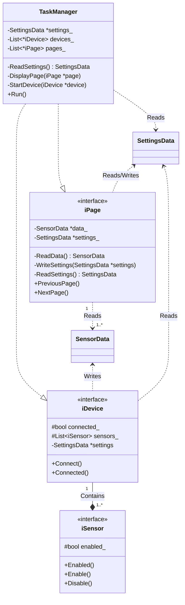

<!---
    Open Cycle Computer (aka OpenCC) is an open-source software
    for cycle computers based on DIY hardware (primarily Raspberry Pi).
    Copyright (C) 2022, Julianno F. C. Silva (@juliannojungle)

    This program is free software: you can redistribute it and/or modify
    it under the terms of the GNU Affero General Public License as published
    by the Free Software Foundation, either version 3 of the License, or
    (at your option) any later version.

    This program is distributed in the hope that it will be useful,
    but WITHOUT ANY WARRANTY; without even the implied warranty of
    MERCHANTABILITY or FITNESS FOR A PARTICULAR PURPOSE.  See the
    GNU Affero General Public License for more details.

    You should have received a copy of the GNU Affero General Public License
    along with this program.  If not, see <https://www.gnu.org/licenses/agpl-3.0.html>.
--->

# Class diagram
- Basic structure of the project.

<!---
    For syntax reference about diagram's markdown, see <https://mermaid-js.github.io/mermaid/#/./classDiagram>.
--->
