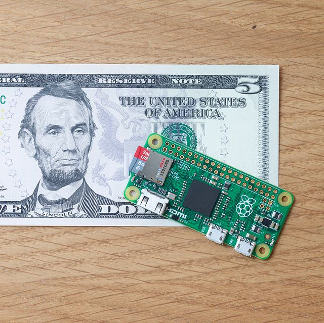

# OpenCC
Open Cycle Computer is an open-source DIY project with the intention to bring useful resources that are appreciated by cyclists to easy-to-work platforms like Raspberry Pi, in a more organized manner than usual apps offer us. The intention is to include integration with some popular services.

 

# Hardware

This very first interaction of the project is based on the following devices:

- **[1.28inch LCD Module](https://www.waveshare.com/wiki/1.28inch_LCD_Module)**, from WaveShare

- **[Raspberry Pi Zero W](https://www.raspberrypi.com/products/raspberry-pi-zero-w/)**, from Raspberry Pi Foundation

# Software

In order to be able to use Raspberry Pi Zero W, we need an OS (operational system) to run our software on.

At this moment, we choose to use [TinyCoreLinux](http://tinycorelinux.net), due the following reasons:

- It's "frugal" install, the system loads itself into RAM from storage and executes from there. This way, we have a fresh start on each boot and the system is not susceptible to data loss from improper shutdown (we can actually just unplug the battery with no harm);
- Straightforward: boots right to the prompt with the default user logged in with enought resources to load the interface, have internet access, use GPIO etc.;
- Startup time gets quite low, with just a few seconds.

 

In the future when the project gets mature enougth, we plan to support [RP2040](https://www.raspberrypi.com/products/rp2040) and on that, the additional OS won't be needed (since it can run C++ code natively).

 

# Notes
This is a work-in-progress project and the documentation will be growing along the development.