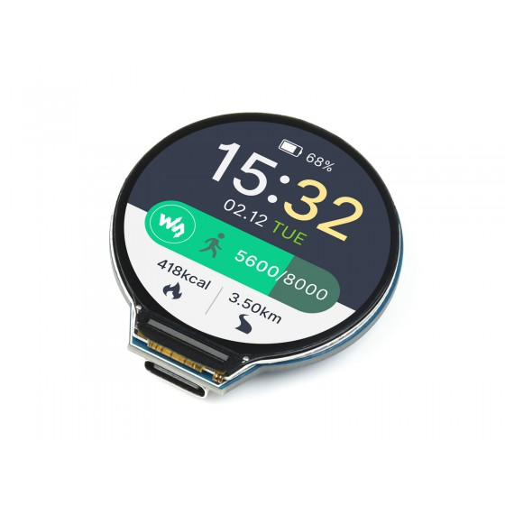
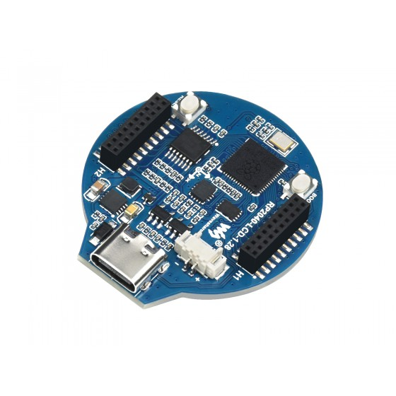

# Pedal Guru
Pedal Guru (former OpenCC) is an open-source DIY project with the intention to bring useful resources that are appreciated by cyclists to easy-to-work platforms like Raspberry Pi and RP2040, in a more organized manner than usual apps offer us. The intention is to include integration with some popular services.

### Note:
> This project is under active develpment. The documentation is growing along the project as it's a work-in-progress. If interested, please check the [development board](https://github.com/users/juliannojungle/projects/1) and the [reference diagram](DIAGRAM.md).

# Hardware

This very first iteration of the project was based on the following devices:

- **[1.28inch LCD Module](https://www.waveshare.com/wiki/1.28inch_LCD_Module)**, from WaveShare (using the [GC9A01 overlay](https://github.com/juliannojungle/gc9a01-overlay))

- **[Raspberry Pi Zero W](https://www.raspberrypi.com/products/raspberry-pi-zero-w/)**, from Raspberry Pi Foundation

Now, we're including the following embedded device:

- **[RP2040-LCD-1.28]([https://www.waveshare.com/wiki/1.28inch_LCD_Module](https://www.waveshare.com/rp2040-lcd-1.28.htm))**, from WaveShare

# Software

- The RP2040-LCD-1.28 doesn't need an additional OS, since it can run C and C++ code natively (aka "bare metal").

- In order to be able to use Raspberry Pi Zero W, we need an OS (operational system) to run our software on.

At this moment, we choose to use [TinyCoreLinux](http://tinycorelinux.net), due the following reasons:

- It's "frugal" install, the system loads itself into RAM from storage and executes from there. This way, we have a fresh start on each boot and the system is not susceptible to data loss from improper shutdown (we can actually just unplug the battery with no harm);
- Straightforward: boots right to the prompt with the default user logged in with enought resources to load the interface, have internet access, use GPIO etc.;
- Startup time gets quite low, with just a few seconds.

To use the GC9A01 based display on TinyCoreLinux, we need to follow [this procedure](https://github.com/juliannojungle/gc9a01-tinycorelinux-tcz).

---
[@juliannojungle](https://github.com/juliannojungle), 2022
